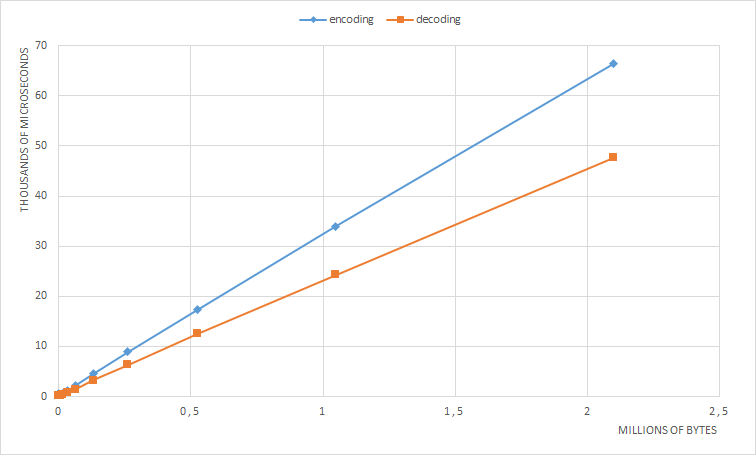
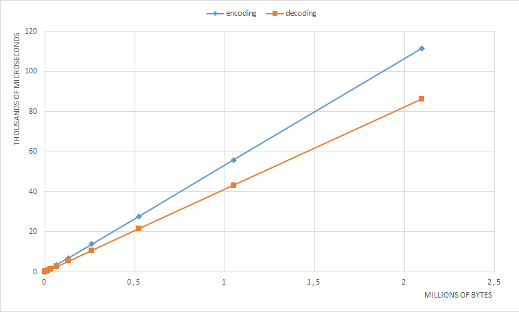
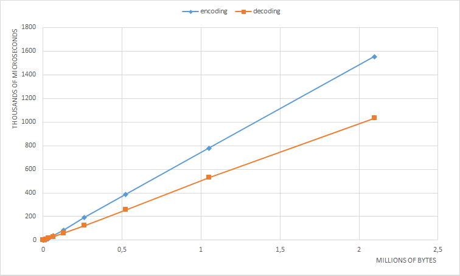

# Performance testing
The testing was conducted by using a text file and a random byte arrays. Each test was run ten times in a row and the resulting values were averaged. The times do not include file loading and all of the processing happens in memory.

The text file used in these tests is [James Joyce's Ulysses](http://www.gutenberg.org/files/4300/4300-h/4300-h.htm) and [Homer's Odyssey](https://www.gutenberg.org/files/1727/1727-h/1727-h.htm) concatenated, which results in a file sized approximatery 2.1 Mb. Using 7zip's deflate algorithm (a mixture of LZ77 and Huffman) the text file compresses to 847 021 bytes. With huffman coding, the test file compresses to 1 278 073 bytes and with LZW 1 033 696 bytes. Clearly deflate is a superior algorithm to my implementations.

The random input is generated by java.util.Random().

## Huffman

The time complexity of Huffman encoding includes the generation of a parse tree, that should be O(n log n). After that the substitution process is just a matter of getting the codeword by index from an array and should be O(n). The decoding process continually traveses the parse tree, but it should not be O(n log n), because every bit in the input is interpreted as a left-right choice when traversing down the tree.

#### Input size (text file)

| input size (bytes) | encoded size (bytes) | encoded / input (%) | encoding time (us) | decoding time (us) |
|---|---|---|---|---|
| 512 | 321 | 62.7 | 598 | 155 |
| 1 024 | 653 | 63.8 | 417 | 284 |
| 2 048 | 1 260 | 61.5 | 446 | 228 |
| 4 096 | 2 474 | 60.4 | 436 | 259 |
| 8 192 | 4 847 | 59.2 | 404 | 202 |
| 16 384 | 9 551 | 58.3 | 607 | 394 |
| 32 768 | 19 065 | 58.2 | 1 168 | 789 |
| 65 536 | 37 939 | 57.9 | 2 218 | 1 487 |
| 131 072 | 75 506 | 57.6 | 4 520 | 3 192 |
| 262 144 | 151 669 | 57.9 | 8 890 | 6 313 |
| 524 288 | 304 277 | 58.0 | 17 334 | 12 552 |
| 1 048 576 | 606 691 | 57.9 | 33 956 | 24 276 |
| 2 097 152 | 1 195 930 | 57.0 | 66 352 | 47 654 |

The compression ratio of Huffman is quite uniform regardless of input length using the text file. Encoding and decoding time seems to grow linearly.

#### Input size (random data)

| input size (bytes) | encoded size (bytes) | encoded / input (%) | encoding time (us) | decoding time (us) |
|---|---|---|---|---|
| 512 | 490 | 95.7 | 65 | 19 |
| 1 024 | 1 006 | 98.2 | 107 | 45 |
| 2 048 | 2 034 | 99.3 | 157 | 92 |
| 4 096 | 4 087 | 99.8 | 285 | 174 |
| 8 192 | 8 192 | 100.0 | 519 | 344 |
| 16 384 | 16 385 | 100.0 | 1 003 | 703 |
| 32 768 | 32 769 | 100.0 | 1 816 | 1 402 |
| 65 536 | 65 537 | 100.0 | 3 571 | 2 672 |
| 131 072 | 131 073 | 100.0 | 6 979 | 5 405 |
| 262 144 | 262 145 | 100.0 | 13 927 | 10 682 |
| 524 288 | 524 289 | 100.0 | 27 835 | 21 647 |
| 1 048 576 | 1 048 577 | 100.0 | 55 796 | 43 169 |
| 2 097 152 | 2 097 153 | 100.0 | 111 674 | 86 217 |

 With random data the compression is very minimal, which is to be expected. Huffman performed much better than LZW (see below).

## Lempel-Ziv-Welch

The time complexity of the LZW encoding should be dominated by the continuos building and seeking of the trie structure. This should lead to O(n log n). Decoding should be more linear as the dictionary is basically an array.

#### Dictionary size (text file)

| Dictionary size | input size (bytes) | encoded size (bytes) | encoded / input (%) | encoding time (us) | decoding time (us) |
|---|---|---|---|---|---|
| 512 | 2 239 620 | 2 995 360 | 133.7 | 79 241 | 751 611 |
| 1 024 | 2 239 620 | 2 364 710 | 105.6 | 98 928 | 593 823 |
| 2 048 | 2 239 620 | 1 973 584 | 88.1 | 128 426 | 499 125 |
| 4 096 | 2 239 620 | 1 687 910 | 75.4 | 163 529 | 450 224 |
| 8 192 | 2 239 620 | 1 467 946 | 65.5 | 205 232 | 429 682 |
| 16 384 | 2 239 620 | 1 289 972 | 57.6 | 255 179 | 426 499 |
| 32 768 | 2 239 620 | 1 152 126 | 51.4 | 326 854 | 428 159 |
| 65 536 | 2 239 620 | 1 033 696 | 46.2 | 427 634 | 440 941 |

Increasing the dictionary size quite clearly improves the compression ratio. When the dictionary size is large enough, the compression ratio exceeds that of Huffman coding.

#### Input size (text file)

| Dictionary size | input size (bytes) | encoded size (bytes) | encoded / input (%) | encoding time (us) | decoding time (us) |
|---|---|---|---|---|---|
| 65 536 | 512 | 1 022 | 199.6 | 12 | 331 |
| 65 536 | 1 024 | 2 032 | 198.4 | 42 | 634 |
| 65 536 | 2 048 | 4 046 | 197.6 | 71 | 1 039 |
| 65 536 | 4 096 | 7 946 | 194.0 | 233 | 3 312 |
| 65 536 | 8 192 | 15 464 | 188.8 | 724 | 3 880 |
| 65 536 | 16 384 | 29 642 | 180.9 | 3 061 | 7 591 |
| 65 536 | 32 768 | 55 288 | 168.7 | 11 816 | 15 503 |
| 65 536 | 65 536 | 100 616 | 153.5 | 39 818 | 30 159 |
| 65 536 | 131 072 | 199 096 | 151.9 | 84 593 | 60 793 |
| 65 536 | 262 144 | 384 880 | 146.8 | 194 384 | 124 400 |
| 65 536 | 524 288 | 769 652 | 146.8 | 388 899 | 258 534 |
| 65 536 | 1 048 576 | 1 538 770 | 146.7 | 778 532 | 530 478 |
| 65 536 | 2 097 152 | 3 075 084 | 146.6 | 1 554 036 | 1 031 452 |

Filesizes of less than 4kb do not benefit much from LZW encoding. Both encoding and decoding time seem to increase linearly. The amount of data points might be too small to make definite conclusions.

#### Input size (random data)

| Dictionary size | input size (bytes) | encoded size (bytes) | encoded / input (%) | encoding time (us) | decoding time (us) |
|---|---|---|---|---|---|
| 65 536 | 512 | 10 220 | 199.6 | 11 | 288 |
| 65 536 | 1 024 | 20 280 | 198.0 | 28 | 560 |
| 65 536 | 2 048 | 40 300 | 196.8 | 70 | 1 004 |
| 65 536 | 4 096 | 79 160 | 193.3 | 232 | 1 971 |
| 65 536 | 8 192 | 154 520 | 188.6 | 773 | 5 372 |
| 65 536 | 16 384 | 296 780 | 181.1 | 3 120 | 7 508 |
| 65 536 | 32 768 | 553 240 | 168.8 | 11 704 | 15 998 |
| 65 536 | 65 536 | 1 006 300 | 153.5 | 40 436 | 29 821 |
| 65 536 | 131 072 | 1 991 300 | 151.9 | 85 094 | 60 952 |
| 65 536 | 262 144 | 3 847 500 | 146.8 | 194 771 | 122 707 |
| 65 536 | 524 288 | 7 696 740 | 146.8 | 387 731 | 246 452 |
| 65 536 | 1 048 576 | 15 385 540 | 146.7 | 775 424 | 526 937 |
| 65 536 | 2 097 152 | 30 761 060 | 146.7 | 1 550 414 | 1 030 650 |

The performance of the LZW is quite terrible with random data. Processing time does not degrade but the compression ratio is poor to say the least.
